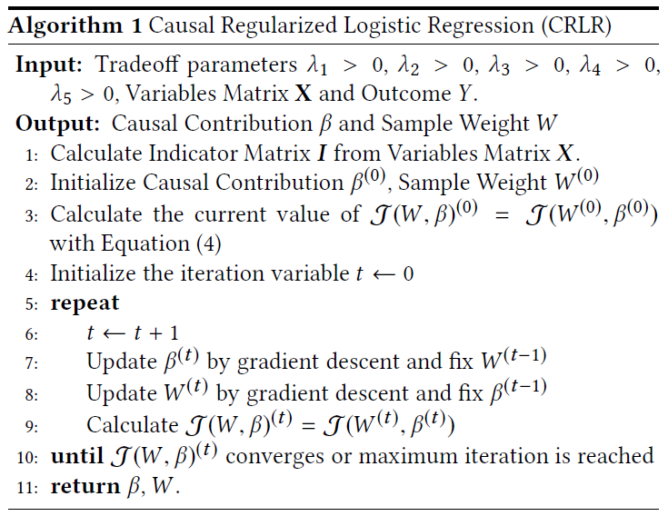
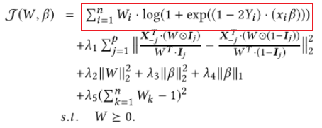
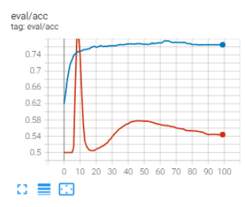
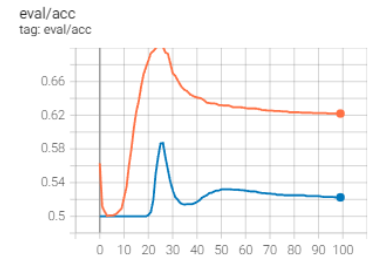

# CRLR 尝试实现

CRLR（Causally Regularized Logistic Regression），是[Shen Z ,  Peng C ,  Kuang K , et al. Causally Regularized Learning with Agnostic Data Selection Bias[C]// 2018 ACM Multimedia Conference. ACM, 2018.](http://arxiv.org/pdf/1708.06656v2) 中提出的方法，目的让模型在训练集与测试集分布不同，且测试集分布不可知时，效果仍然较好。

但我在网上并没有找到可用代码，因此自己尝试实现一下，不一定正确。


# 算法伪代码



# 修改和设定

为了方便实现，对公式做了如下修改：




将红框中部分改为交叉熵损失，并使用神经网络框架自动优化。

由于不太了解图像领域，因此使用了自然语言处理领域的数据。

因为只是简单尝试，因此并没有找很多数据集，只是进行了一些模拟设定，如下：

- 数据集：aclImdb大型电影评论数据集，将文本数据用bert-base-uncased转化为768维特征后作为X，用二维向量表示结果Y的情感。

- 神经网络：768 →2全连接网络。

- 干预设置：论文中有提到将数据进行二值化的操作。当干预X分布时，我以每个维度的均值为界，大于均值为1，小于为0，以此来模拟干预。

- 不可知选择模拟：原数据有25000个训练集和测试集，我只使用10—200个数据（0.4%—1%）的数据进行训练，用1000—10000个测试数据进行测试，来模拟外部不可知数据。

- 对比：使用两个相同结构的神经网络，一个加因果正则优化，一个不加，使用相同的超参和数据进行性能对比。

- 数据量：由于优化W时需要所有数据的X，prediction，I，W，且计算复杂度很高，因此只使用了少量数据进行测试（代码水平有限以及电脑机能限制也是部分原因）。

# 主要库

```
torch==1.11.0
tensorboard==2.8.0
datasets==2.1.0
numpy==1.21.5
tqdm
```

# 使用方法

在`causally_regularized_learning.py`中的超参部分设定超参，然后运行`causally_regularized_learning.py`即可。

训练完后可用使用`tensorboard`查看日志。

# 一些实验结果

```
###########超参
train_num_pos = 18
train_num_neg = 2
eval_num = 1000
lambdas = {
    1: 1e-3,# confounder loss
		2: 1e-2,# w l2
		3: 1e-5,# f l2
		4: 1e-5,# f l1
		5: 1e-1,# avoid 0
}
set_pytorch_seed(626)
batch_size = 100
epochs = 100
lr = 1e-2
lr_w = 1e-3
change_distribution = True
clip=None
#####超参 CRLR 0.765 Normal 0.544
```




```
###########超参
train_num_pos = 198
train_num_neg = 2
eval_num = 1000
lambdas = {
    1: 1e-3,# confounder loss
    2: 1e-2,# w l2
    3: 1e-5,# f l2
    4: 1e-5,# f l1
    5: 1e-1,# avoid 0
}
set_pytorch_seed(626)
batch_size = 100
epochs = 100
lr = 1e-2
lr_w = 1e-3
change_distribution = True
#####超参 CRLR 0.622 Normal 0.5225
```



**更多实验可用查看PPT实验超参及结果。**